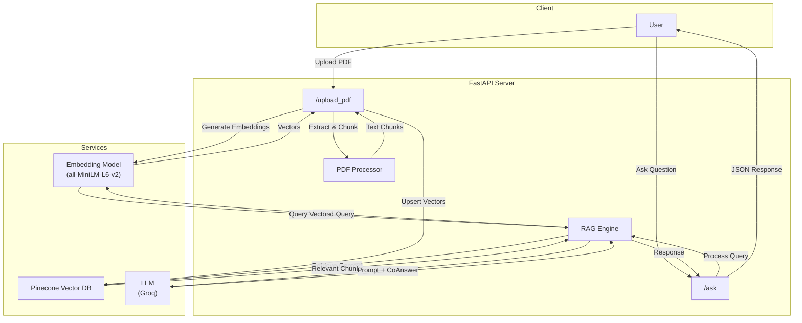

# PDF RAG Chatbot API

A Retrieval-Augmented Generation (RAG) API that allows you to upload PDF documents and ask questions about their content. It uses **FastAPI** for the backend, **Pinecone** for vector storage, **Sentence Transformers** for embeddings, and **Groq** for fast LLM inference.

## Architecture



## Features

-   **PDF Ingestion**: Upload PDF files to extract text and chunk it for processing.
-   **Vector Search**: Uses Pinecone to store and retrieve relevant text chunks based on semantic similarity.
-   **Question Answering**: Generates answers using Groq's cloud-hosted LLMs (default: Llama 3.3 70B), grounded in the retrieved context.
-   **Modular Design**: Clean separation of concerns (API, Config, PDF Processing, RAG Engine).

## Tech Stack

-   **Framework**: FastAPI
-   **Vector Database**: Pinecone
-   **Embeddings**: `sentence-transformers/all-MiniLM-L6-v2`
-   **LLM**: Groq API (supports Llama 3.3, Mixtral, and other models)
-   **PDF Processing**: pypdf

## Installation

1.  **Clone the repository:**
    ```bash
    git clone <repository-url>
    cd <repository-directory>
    ```

2.  **Install dependencies:**
    ```bash
    pip install -r requirements.txt
    pip install python-dotenv
    ```

3.  **Set up Environment Variables:**
    Copy the `.env.example` file to `.env` and add your API keys:
    ```bash
    cp .env.example .env
    ```
    Then edit `.env` and add your keys:
    ```env
    PINECONE_API_KEY=your_pinecone_api_key_here
    GROQ_API_KEY=your_groq_api_key_here
    ```
    
    Get your Groq API key from: https://console.groq.com/keys

## Usage

1.  **Start the server:**
    ```bash
    uvicorn main:app --reload
    ```

2.  **API Endpoints:**

    -   **`GET /`**: Health check. Returns a welcome message.
    -   **`POST /upload_pdf`**: Upload a PDF file to be indexed.
        -   **Body**: `form-data` with key `pdf` and file value.
    -   **`POST /ask`**: Ask a question about the uploaded PDF.
        -   **Body**: JSON object `{"query": "Your question here"}`

## Docker Setup

You can also run this application using Docker.

1.  **Build the Docker image:**
    ```bash
    docker build -t pdf-rag-app .
    ```

2.  **Run the Docker container:**
    Make sure you have your `.env` file set up as described in the Installation section.
    ```bash
    docker run -p 8000:8000 --env-file .env pdf-rag-app
    ```
    The API will be available at `http://localhost:8000`.

## Project Structure

-   `main.py`: FastAPI application and route definitions.
-   `config.py`: Configuration and initialization of services (Pinecone, Models).
-   `pdf_processor.py`: Logic for extracting and chunking text from PDFs.
-   `rag_engine.py`: Core RAG logic (Retrieval + Generation).
-   `requirements.txt`: Python dependencies.
